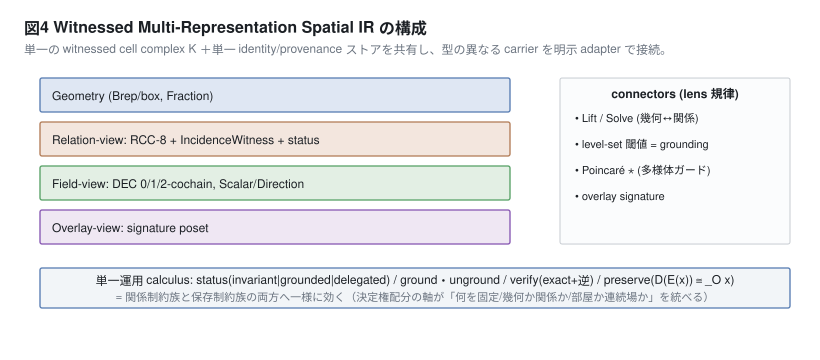

# Deixis — Witnessed Relational Spatial IR with Deferred Grounding

A relation-first way to describe space: qualitative RCC-8 relations plus contact witnesses *before* any geometry, solved to exact geometry in a limited domain and reverse-verified against the spec.

> 日本語要約: 卒業研究に付随する研究用実装。空間を幾何より先に RCC-8 関係＋接触の証人（面・線・点）で記述し、厳密な箱幾何へ解いて逆検証する Python コアと Grasshopper 層。

## Status

**Research prototype (v0.0.1), written 2026-07-18/19 as a companion to undergraduate thesis research.** The Python core is extensively unit-tested; the geometric domain is deliberately narrow and the Grasshopper layer is a thin, manually-installed shell.

| | |
|---|---|
| Works | Python core (`src/deixis`, ~11k lines): RCC-8 / RCC-5 algebra, path consistency, contact witnesses, deferred grounding, Z3-backed box solver, reverse verification, serialization. **695 tests passed** (re-run 2026-09-28, Python 3.12, `z3-solver` 4.15.4; ~2 s). |
| Works | Headless demos `demo1_contact_dimension` and `demo7_roundtrip` run and print their comparisons (see Usage). |
| Partial | Geometry is **axis-aligned boxes with exact rational coordinates** only. Realizations are "relation-preserving re-synthesis" in that domain — they do not preserve original surfaces or topology of arbitrary input geometry. |
| Partial | Grasshopper layer (`docs/grasshopper/`, 7 components for Rhino 8 CPython): each component is a thin shell over the tested `deixis.io.adapters` functions, but the Rhino side is set up by hand (paste scripts, add params) and was not re-verified for this README. |
| Partial | Extensions beyond the core claim — flow fields (DEC), isovists, space-syntax access graph, Allen / Rectangle Algebra, presolve, Dulmage–Mendelsohn diagnostics — are research aids with their scope limits stated in module docstrings. |
| Known issues | Grasshopper scripts and `SETUP.md` use a placeholder `src` path that must be edited (or passed as the `deixis_src` input). `SETUP.md` cites an older test count. The design spec referenced in code docstrings ("v7 spec") is not included in the repo. On some platforms `z3-solver` has no wheel for the newest release and fails to build from source — install with a prebuilt wheel. |

**Development note:** commit history records AI-assisted development (Claude as co-author).

## Background

Companion implementation of the author's undergraduate thesis research on notation in computational design (2026). The thesis question is what a *spatial description* can hold that geometry and today's modeling constructs cannot. The central demonstration (demo1): RCC-8's single `EC` ("externally connected") symbol collapses face, edge and point contact, but a witnessed IR keeps the intended contact dimension as a geometry-independent invariant — something IFC, Topologic or standard Grasshopper constructs cannot hold *before* geometry exists.

**Scope, as stated by the project:** this is an integrated, executable IR with an explicit preservation contract for the spatial-relations subdomain — *not* a new topology theory, *not* a claim of principled inexpressibility, and *not* full bidirectionality.

## Concepts

- **Relations first.** Regions are related by RCC-8 constraints (possibly disjunctive masks), checked by path consistency.
- **Contact witnesses.** An `EC` relation can carry a witness of intended contact dimension (face / line / point), and shared boundaries are co-referenced cells.
- **Deferred grounding.** Each relation is marked invariant / grounded / delegated — who decides it, and when. Grounding operations are pure functions over an immutable `RelSpec`.
- **Solve, then reverse-verify.** A two-stage, fail-closed pipeline lowers the spec to linear constraints over exact rational boxes (Z3), then re-extracts relations and contact dimensions from the result and compares them against the spec. It never claims a realizability level it cannot back.
- **Honest projections.** Lossy views/exports (group views, DE-9IM, RDF with BOT + PROV-O) emit a machine-readable `LossReport`.



## Layout

```
src/deixis/core/         types (M0 contract), ids/Fraction/provenance, RCC-8, RCC-5
src/deixis/solver/       path consistency, geom_solver (Z3 → exact AABBs), presolve, family,
                         Allen interval algebra, Rectangle Algebra
src/deixis/incidence/    contact witnesses, shared boundaries, overlay poset
src/deixis/grounding/    ground / unground (immutable)
src/deixis/verify/       reverse verification, DE-9IM for boxes
src/deixis/pipeline.py   two-stage fail-closed realizability pipeline (+ pipeline_effects.py)
src/deixis/bidir/        turn-based relation ⇄ geometry session maintainer
src/deixis/field/        scalar fields + threshold-as-grounding, DEC flow, isovist
src/deixis/analysis/     space-syntax access graph / centrality, flow → choice
src/deixis/geom/         transformation-group views
src/deixis/diagnostics/  Dulmage–Mendelsohn structural diagnosis
src/deixis/io/           JSON serialization, RDF export, LossReport, Grasshopper adapters
src/deixis/demos/        demo1 (contact dimension), demo7 (full round-trip)
docs/grasshopper/        Rhino 8 script components + SETUP.md
docs/figures/            SVG figures (+ gen_figures.py)
tests/                   pytest
```

## Usage

Requires Python ≥ 3.11.

```bash
python -m venv .venv && . .venv/bin/activate
pip install -e ".[dev,geom]"
pytest -q

python -m deixis.demos.demo1_contact_dimension   # RCC-8 vs witnessed contact dimension
python -m deixis.demos.demo7_roundtrip           # geometry → spec → grounding → family → verify
```

Grasshopper: see [`docs/grasshopper/SETUP.md`](docs/grasshopper/SETUP.md). Specs travel between components as JSON strings; the components are Lift · Relate · Witness · Ground · Solve · Verify · Family.

## Related

- Region Connection Calculus — Randell, Cui & Cohn (1992)
- Allen's interval algebra; Rectangle Algebra
- Space syntax — Hillier & Hanson, *The Social Logic of Space* (1984); isovists — Benedikt (1979)
- [Z3](https://github.com/Z3Prover/z3), [BOT ontology](https://w3c-lbd-cg.github.io/bot/), [PROV-O](https://www.w3.org/TR/prov-o/)

## License

MIT — see [LICENSE](LICENSE).
